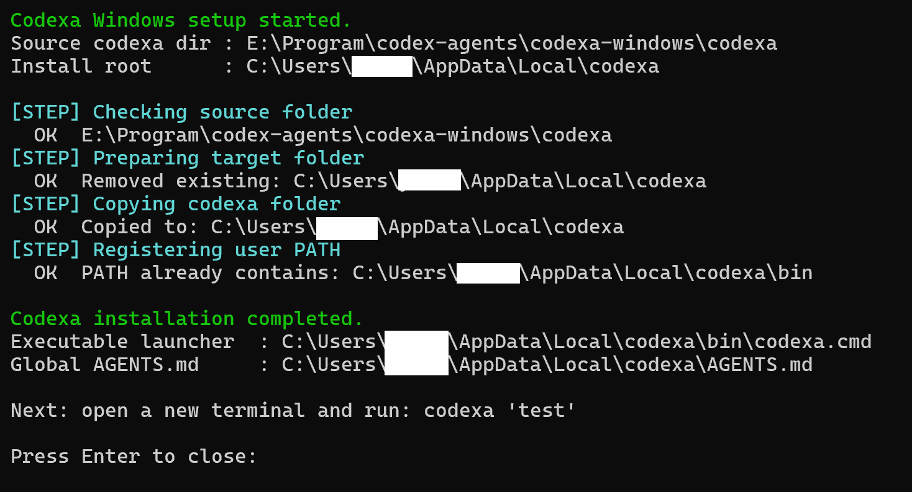

# Codexa

 

## 개요

Codexa는 `codex` CLI를 보조하는 경량 래퍼입니다.

아래 3가지를 순서대로 합쳐서 하나의 프롬프트로 `codex`에 전달합니다.

- 전역 `AGENTS.md`: 공통 기준 규칙
- 로컬 `AGENTS.md`: 현재 호출 위치의 프로젝트/작업별 규칙
- 사용자가 입력한 프롬프트(선택)

이 방식으로 전역 표준은 유지하면서도, 프로젝트별로 다른 페르소나/작업 방식을 적용할 수 있습니다.
또한 ChatGPT 계정이 달라도 같은 에이전트 동작 기준을 재현할 수 있습니다.

## 구성

운영체제별 구성 요소를 사용해 설치/실행할 수 있습니다.

```
📦codexa-agents
┣ 📂codexa-windows
┃ ┣ 📂codexa
┃ ┗ ⚙️ setup-windows.ps1: Windows 설치 스크립트 (폴더 복사 + PATH 등록)
┗ ⚙️codexa.sh: macOS zsh 실행 스크립트
```

> 현재 자동 설치 스크립트는 Windows 기준으로 제공되며, macOS 설치 스크립트는 추후 추가될 예정입니다.

## Windows 설치

### 사전 조건

1. `codex` CLI를 설치합니다.
2. 터미널에서 `codex` 명령이 실행 가능해야 합니다.

### 설치 절차

1. `PowerShell`로 `.\codexa-windows\setup-windows.ps1`를 실행합니다.
   

1. 환경 변수 설정 및 codexa 동작을 확인합니다.

```bash
where codexa
codexa "test"
```

### 환경변수 등록

`PATH` (User 범위): `%LOCALAPPDATA%\codexa\bin` 추가

## 실행 시 동작(Windows)

- 진입점: `codexa` (`%LOCALAPPDATA%\codexa\bin\codexa.cmd`)
- 핵심 로직: `%LOCALAPPDATA%\codexa\bin\codexa.ps1`
- 전역 AGENTS: `%LOCALAPPDATA%\codexa\AGENTS.md` (`bin` 기준 `..\AGENTS.md`)
- 로컬 AGENTS: 현재 폴더의 `./AGENTS.md`

## macOS 설치

1. `codexa.sh`를 PATH에 포함된 디렉터리로 복사합니다.
   ```bash
   install -d "$HOME/bin"
   install codexa.sh "$HOME/bin/codexa"
   ```
2. 셸 설정 파일에 PATH를 추가합니다. (Zsh 기준)
   ```bash
   echo 'export PATH="$HOME/bin:$PATH"' >> ~/.zshrc
   ```
3. 전역으로 사용할 AGENTS.md를 설정한 경로에 복사/이동합니다.  
   예시 명령어는 다음과 같습니다.

   ```bash
   mkdir -p ~/.config/codexa
   cp ./AGENTS.md ~/.config/codexa/AGENTS.md
   ```

   > macOS에서 전역 AGENTS 기본 위치는 `~/.config/codexa/AGENTS.md` 입니다.

4. 터미널을 재시작하거나 다음 명령을 실행합니다.
   ```bash
   source ~/.zshrc
   ```

## 라이선스

[LICENSE](LICENSE) 참고.
